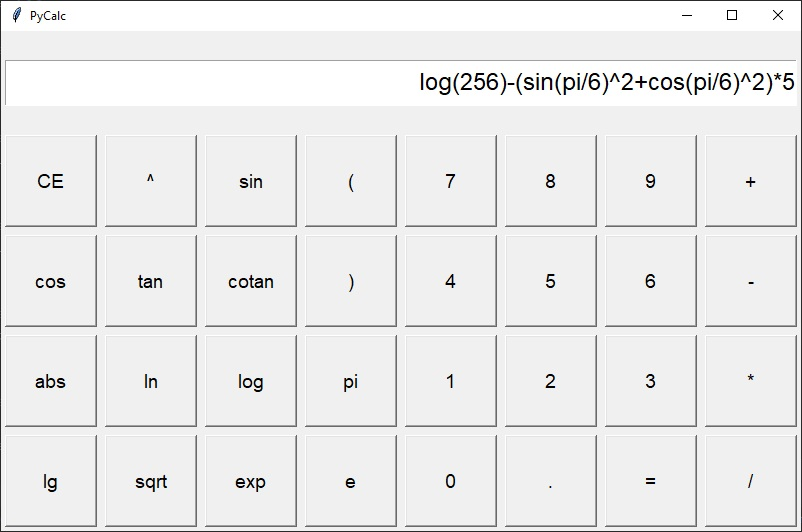
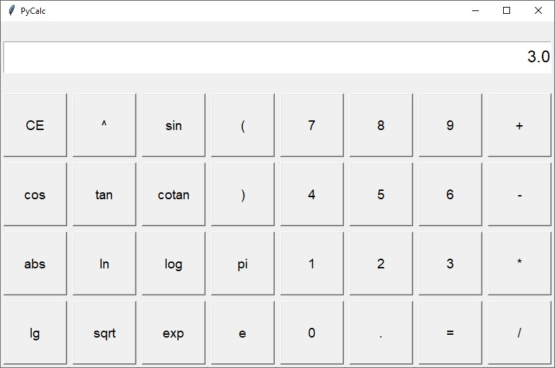
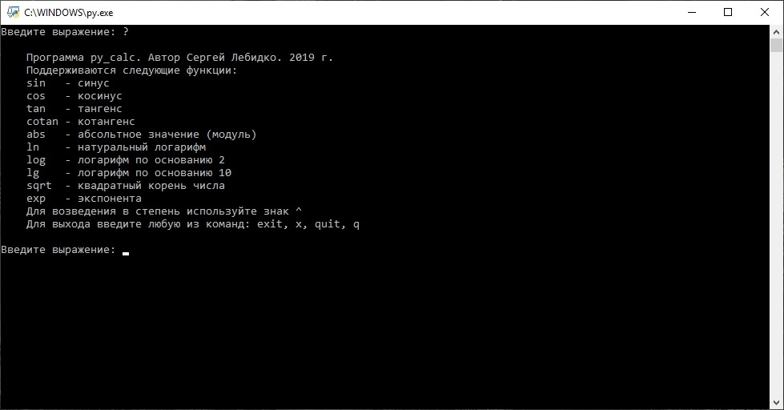
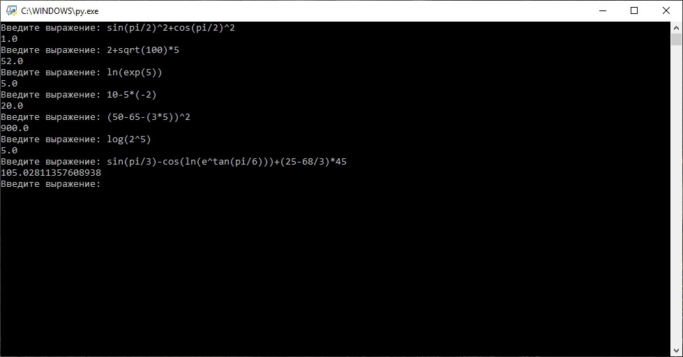

# PyCalc

Простой калькулятор на Python. Может работать в режиме командной строки (для этого надо запустить файл py_calc_shell) и в оконном режиме (нужно запустить файл py_calc_gui). Графический интерфейс реализован с помощью библиотеки Tkinter.
В файле py_calc находятся служебные функции, одна из которых - calculate является главной. Именно она возвращает значение вычисленного выражения, либо порождает исключение, если выражение вычислить не удалось.
Скриншоты проекта - ниже:

